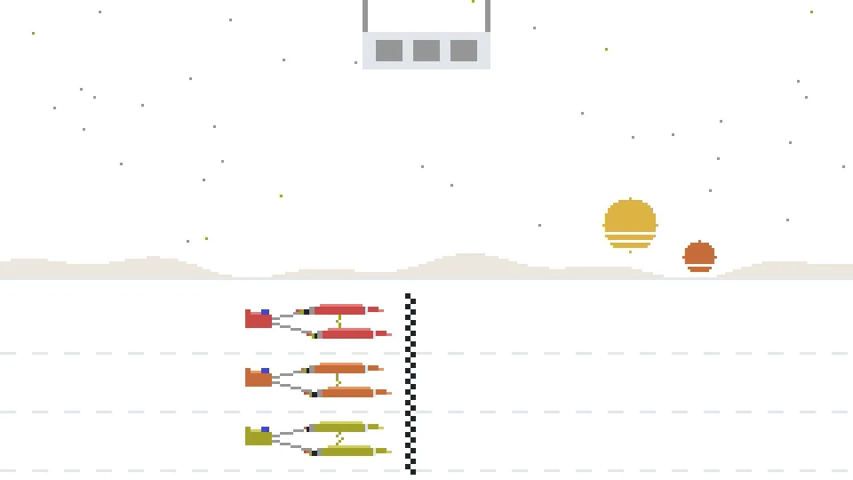

<div align="center">

# 🏜️ boonta

**Distributed reinforcement learning in JAX, built on the [Podracer architectures](https://arxiv.org/abs/2104.06272).**

*boonta* [ˈbuːn.tə]: the Boonta Eve Classic, the podrace Anakin Skywalker wins on Tatooine in *The Phantom Menace*.

<picture>
  <source media="(prefers-color-scheme: dark)" srcset="docs/demo-dark.webp">
  
</picture>

</div>

## Podracers

| Podracer | How it works | Use it for |
| --- | --- | --- |
| Anakin | Acting, environment steps and learning compile into one program, split across every device | JAX environments, end to end on the GPU |
| Sebulba | Actor threads collect rollouts on some devices while learners train on the rest and send back fresh parameters | Slow or non-JAX environments, acting and learning asynchronously |
| Quadinaros | Trains on batches sampled from a Minari dataset and only touches the environment to evaluate | Fixed datasets, for offline RL and behavior cloning |

## Algorithms

| Kind | Algorithms |
| --- | --- |
| On-policy | [PPO](https://arxiv.org/abs/1707.06347), [REPPO](https://arxiv.org/abs/2507.11019), [PQN](https://arxiv.org/abs/2407.04811), [GRPO](https://arxiv.org/abs/2402.03300) |
| Off-policy | [DQN](https://arxiv.org/abs/1312.5602), [SAC](https://arxiv.org/abs/1801.01290) |
| Offline | [IQL](https://arxiv.org/abs/2110.06169) |
| Recurrent | [PPO](https://arxiv.org/abs/1707.06347), [PuPO](https://github.com/PufferAI/PufferLib), [PQN](https://arxiv.org/abs/2407.04811), [GRPO](https://arxiv.org/abs/2402.03300), [DQN](https://arxiv.org/abs/1312.5602), [SAC](https://arxiv.org/abs/1801.01290) |
| Multi-agent | [IPPO](https://arxiv.org/abs/2011.09533), [MAPPO](https://arxiv.org/abs/2103.01955), [PSRO](https://arxiv.org/abs/1711.00832) |

## Environments

| Kind | Environments |
| --- | --- |
| Classic control and MinAtar | [Gymnax](https://github.com/RobertTLange/gymnax) |
| Continuous control | [Brax](https://github.com/google/brax), [MuJoCo Playground](https://github.com/google-deepmind/mujoco_playground), [Isaac Lab](https://github.com/isaac-sim/IsaacLab) |
| Grid worlds and puzzles | [Jumanji](https://github.com/instadeepai/jumanji), [XLand-MiniGrid](https://github.com/dunnolab/xland-minigrid) |
| Open-ended | [Craftax](https://github.com/MichaelTMatthews/Craftax) |
| Atari | [ALE](https://github.com/Farama-Foundation/Arcade-Learning-Environment) |
| Multi-agent | [JaxMARL](https://github.com/FLAIROx/JaxMARL), [Mapox](https://github.com/gabe00122/mapox) |
| Games | Pokémon Red on [Peanut-GB](https://github.com/deltabeard/Peanut-GB) |

## Install

```bash
pip install boonta            # the library
pip install "boonta[hangar]"  # the library, plus Hydra to run the configs in hangar
```

The library never imports `hangar`, Hydra or OmegaConf. In a checkout, `uv sync --extra hangar` installs it. Environment suites that need their own packages come as extras too, such as `boonta[craftax]`. `uv sync` installs exactly the extras it is given, so pass every one you use in one command, for example `uv sync --extra hangar --extra craftax`.

## Guides

- [hangar](hangar/README.md): run training from the command line, config groups, several machines, sweeps
- [Podracers](boonta/podracers/README.md): the training loops, and which one to pick
- [Algorithms](boonta/algorithms/README.md): the algorithm interface, and how to add an algorithm
- [Networks](boonta/networks/README.md): heads, recurrent torsos and stacks, mixed precision
- [Environments](boonta/environments/README.md): the environment interface, wrappers, and how to add an environment
- [Datasets](boonta/datasets/README.md): offline data for `quadinaros`, and how to add a dataset
- [Recipes](hangar/recipes/README.md): how a run is put together from its parts
