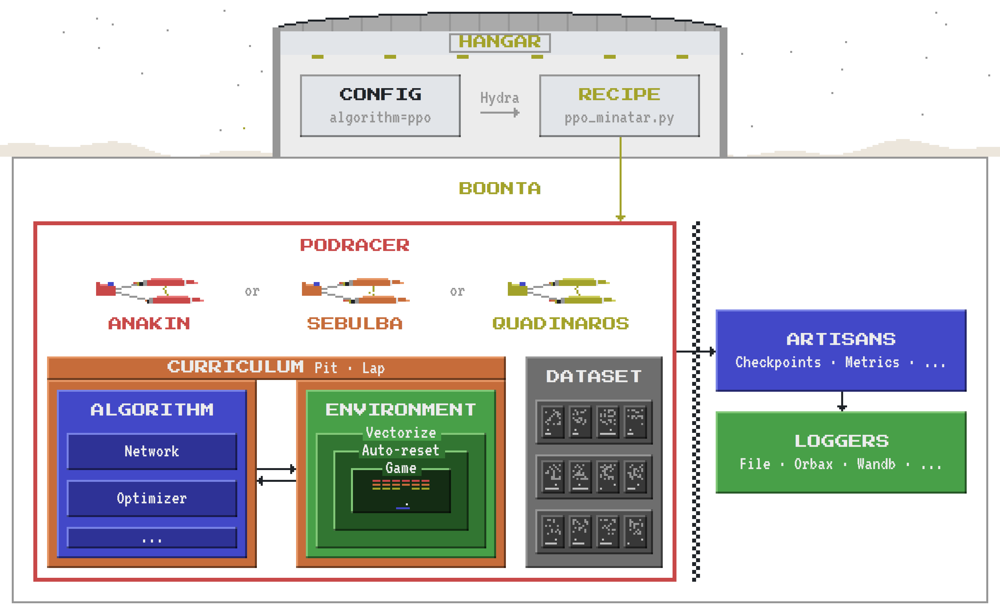

<div align="center">

# 🏜️ boonta

**Distributed reinforcement learning in JAX, built on the [Podracer architectures](https://arxiv.org/abs/2104.06272).**

*boonta* [ˈbuːn.tə]: the Boonta Eve Classic, the podrace Anakin Skywalker wins on Tatooine in *The Phantom Menace*.

<picture>
  <source media="(prefers-color-scheme: dark)" srcset="docs/structure-dark.webp">
  
</picture>

</div>

## Why boonta

boonta splits reinforcement learning into three pieces that stay out of each other's way. The algorithm decides and learns without ever touching the environment or the hardware. The environment looks the same whether it is written in JAX, runs in Gymnasium or calls into C++. The podracer runs the loop and owns the devices. Because each piece only knows its own job, the same PPO trains a CNN on MinAtar, an MLP on CartPole or Qwen3 playing Wordle through tool calls, and moving it from a JAX environment on the GPU to a slow Gymnasium one takes a different podracer, not a rewrite.

## Podracers

🏎️ **Anakin** is for JAX environments. Acting, stepping and learning compile into one program that runs on every device.

🔧 **Sebulba** is for slow or non-JAX environments. Actors collect rollouts on some devices while learners train on the rest.

📼 **Quadinaros** is for offline RL and BC. It trains on a fixed dataset and only steps the environment to evaluate.

## In the hangar

**Algorithms**
- On-policy: [PPO](https://arxiv.org/abs/1707.06347) · [REPPO](https://arxiv.org/abs/2507.11019) · [PQN](https://arxiv.org/abs/2407.04811) · [GRPO](https://arxiv.org/abs/2402.03300)
- Off-policy: [DQN](https://arxiv.org/abs/1312.5602) · [SAC](https://arxiv.org/abs/1801.01290)
- Offline: BC · [IQL](https://arxiv.org/abs/2110.06169)
- Recurrent: PPO · [PuPO](https://github.com/PufferAI/PufferLib) · PQN · GRPO · DQN · SAC · BC
- Multi-agent: [IPPO](https://arxiv.org/abs/2011.09533) · [MAPPO](https://arxiv.org/abs/2103.01955) · [MMD](https://arxiv.org/abs/2206.05825) · [PSRO](https://arxiv.org/abs/1711.00832)

**Environments**
- Control: [Gymnax](https://github.com/RobertTLange/gymnax) · [Brax](https://github.com/google/brax) · [MuJoCo Playground](https://github.com/google-deepmind/mujoco_playground) · [Isaac Lab](https://github.com/isaac-sim/IsaacLab)
- Grid worlds and open-ended: [Jumanji](https://github.com/instadeepai/jumanji) · [XLand-MiniGrid](https://github.com/dunnolab/xland-minigrid) · [Craftax](https://github.com/MichaelTMatthews/Craftax)
- Levels: [Kinetix](https://github.com/FLAIROx/Kinetix) · [JaxUED](https://github.com/DramaCow/jaxued)
- Multi-agent: [JaxMARL](https://github.com/FLAIROx/JaxMARL) · [Mapox](https://github.com/gabe00122/mapox) · [BluffJAX](https://github.com/AryamanReddi99/bluffjax) · [ConnectX](https://www.kaggle.com/competitions/connectx)
- Games: [Atari](https://github.com/Farama-Foundation/Arcade-Learning-Environment) · Pokémon Red on [Peanut-GB](https://github.com/deltabeard/Peanut-GB) · Wordle
- Anything else: [Gymnasium](https://github.com/Farama-Foundation/Gymnasium) vector environments

**Curricula**
- [PLR](https://arxiv.org/abs/2110.02439) replays the levels the agent learns most from
- League trains against a pool of earlier policies, picked by [PSRO](https://arxiv.org/abs/1711.00832) meta-solvers

## Install

boonta is not on PyPI. Install it from a checkout with [uv](https://docs.astral.sh/uv/):

```bash
git clone https://github.com/noahfarr/boonta && cd boonta
uv sync                  # the library
uv sync --extra hangar   # the library, plus Hydra to run the configs in hangar
```

The library never imports `hangar`, Hydra or OmegaConf. Environment suites that need their own packages come as extras too, such as `craftax`. `uv sync` installs exactly the extras it is given, so pass every one you use in one command, for example `uv sync --extra hangar --extra craftax`.

## Guides

- [hangar](hangar/README.md): run training from the command line, config groups, several machines, sweeps
- [Podracers](boonta/podracers/README.md): the training loops, and which one to pick
- [Algorithms](boonta/algorithms/README.md): the algorithm interface, and how to add an algorithm
- [Networks](boonta/networks/README.md): heads, recurrent torsos and stacks, mixed precision
- [Environments](boonta/environments/README.md): the environment interface, wrappers, and how to add an environment
- [Datasets](boonta/datasets/README.md): offline data for `quadinaros`, and how to add a dataset
- [Recipes](hangar/recipes/README.md): how a run is put together from its parts
